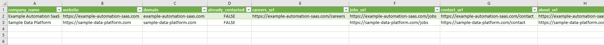
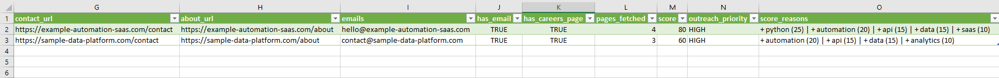
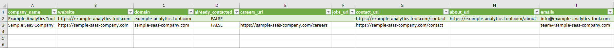
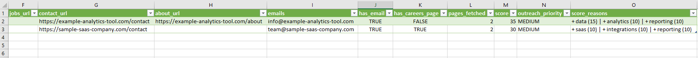
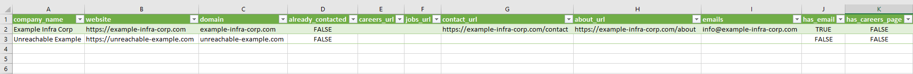
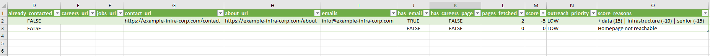

# Startup Outreach Finder

A Python-based automation system that discovers, analyzes, and prioritizes startup companies for targeted outreach.

Instead of applying randomly to jobs, this project identifies high-fit companies based on data, automation, and API-related signals.

---

## Why this project exists

Most developers apply to hundreds of jobs with low response rates.

This project takes a different approach:

- Find relevant startups
- Analyze their websites and data
- Score them based on technical fit
- Generate a prioritized outreach list

Result: **smarter targeting instead of mass applications**

---

## What it does

This system:

- Collects startup websites
- Extracts relevant company pages (careers, jobs, contact, about)
- Scrapes and processes multiple pages per company
- Extracts public email addresses
- Analyzes visible website text
- Scores companies based on relevance to:
  - Python
  - automation
  - APIs
  - data / analytics / pipelines
- Filters and categorizes leads into:
  - HIGH priority
  - MEDIUM priority
  - LOW / discarded

---

## Example workflow

Input:
100 startup websites

↓ scraping + processing

↓ scoring based on keywords

Output:
10–20 high-priority leads


## Project structure

The project is structured as a simple data pipeline:

``` markdown
src/
├── main.py # pipeline entry point
├── scraper.py # HTML fetching & navigation
├── extractor.py # link and content extraction
├── scorer.py # company scoring logic
├── utils.py # helpers
├── thehub_collector.py # example startup data collector

data/
├── startups.csv # input sample
├── thehub_startups.csv # collected sample

output/
├── high_priority_leads.csv
├── manual_review_leads.csv
├── discarded_leads.csv
```

## Example output

See screenshots below for full output examples.

## Key idea

This project demonstrates:

- automation thinking
- data-driven decision making
- API & scraping workflows
- building a simple but complete pipeline

## Notes
- This repository includes sample data only
- Real datasets and contacted companies are excluded
- Scraping should respect each site's terms of service


## How to run

```bash
pip install -r requirements.txt
python src/main.py
```


## Author

Csaba Mészáros

Junior Python Developer focused on automation, APIs, and data workflows

GitHub: https://github.com/csabametzg


## Example result

The output shows how companies are categorized by score and outreach priority.


#### High priority leads





#### Manual review leads





#### Discarded leads


